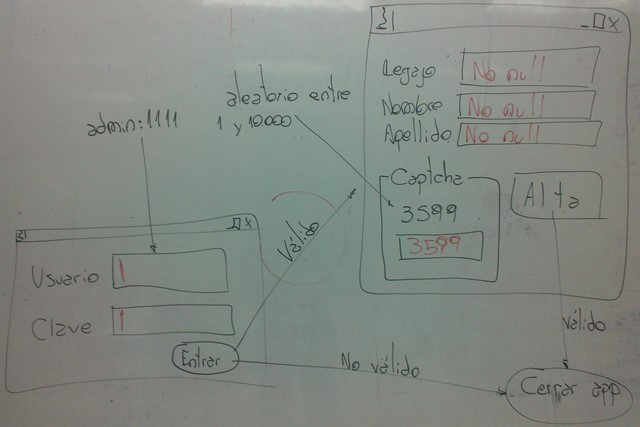

.. -*- coding: utf-8 -*-

.. _rcs_subversion:

Clase 05 - POO 2024
===================
(Fecha: 25 de marzo)

Registro en video de algunos temas de la clase de hoy
^^^^^^^^^^^^^^^^^^^^^^^^^^^^^^^^^^^^^^^^^^^^^^^^^^^^^

`Help signal slot QSlider QSpinBox 2021 <https://www.youtube.com/watch?v=BHog8TPjnos>`_

`QGridLayout - Q_OBJECT - Archivos del Qt Project 2021 <https://www.youtube.com/watch?v=KwtBKCs4B1c>`_

`Dibujar a mano - QByteArray - Preprocesador 2021 <https://www.youtube.com/watch?v=8Gu5_ejipus>`_

Signals y slots
^^^^^^^^^^^^^^^

- signal y slot son funciones.
- Las signals de una clase se comunican con los slots de otra.
- Se deben conectar con la función connect de QObject.
- Un evento puede generar una signal.
- Los slots reciben estas signals.
- SIGNAL() y SLOT() son macros (convierten a cadena).
- emisor y receptor son punteros a QObject

.. code-block:: c

	QObject::connect( emisor, SIGNAL( signal ), receptor, SLOT( slot ) );
	
- Se puede remover la conexión:

.. code-block:: c

	QObject::disconnect( emisor, SIGNAL( signal ), receptor, SLOT( slot ) );

**Ejemplo:** QPushButton para cerrar la aplicación.

.. code-block:: c

	#include <QApplication>
	#include <QPushButton>

	int main( int argc, char** argv )  {
	    QApplication a( argc, argv );
	    QPushButton* boton = new QPushButton( "Salir" );

	    QObject::connect( boton, SIGNAL( pressed() ), &a, SLOT( quit() ) );
	    boton->setVisible( true );
		
	    return a.exec();
	}

Macro Q_OBJECT
^^^^^^^^^^^^^^

- Convierte a una clase cualquiera en una clase Qt.
- Una clase Qt permitirá trabajar con signals y slots.
- Incluir la macro Q_OBJECT en la primer línea de la definición de la clase.

	
**Ejemplo:** Control de volumen

.. code-block:: c

	#include <QApplication>
	#include <QWidget>
	#include <QHBoxLayout>
	#include <QSlider>
	#include <QSpinBox>

	int main( int argc, char** argv )  {
	    QApplication a( argc, argv );

	    QWidget * ventana = new QWidget;  // Es la ventana padre (principal)
	    ventana->setWindowTitle( "Volumen" ); 
	    ventana->resize( 300, 50 );

	    QSpinBox * spinBox = new QSpinBox;
	    QSlider * slider = new QSlider( Qt::Horizontal );
	    spinBox->setRange( 0, 100 );
	    slider->setRange( 0, 100 );

	    QObject::connect( spinBox, SIGNAL( valueChanged( int ) ), slider, SLOT( setValue( int ) ) );
	    QObject::connect( slider, SIGNAL( valueChanged( int ) ),  spinBox, SLOT( setValue( int ) ) );

	    spinBox->setValue( 15 );

	    QHBoxLayout * layout = new QHBoxLayout;
	    layout->addWidget( spinBox );
	    layout->addWidget( slider );
	    ventana->setLayout( layout );
	    ventana->setVisible( true );	

	    return a.exec();
	}
	

QGridLayout
^^^^^^^^^^^

- Ubica los widgets en una grilla
- Con setColumnMinimumWidth() podemos setear el ancho mínimo de columna
- Separación entre widget con setVerticalSpacing( int )
- void addWidget( QWidget * widget, int fila, int columna, int spanFila, int spanCol )

QLineEdit
^^^^^^^^^

.. code-block:: c

	QLineEdit * le = new QLineEdit;
	le->setEchoMode( QLineEdit::Password );
	le->setEnabled( false );

	// QLineEdit::Normal  // Se visualizan al escribir
	// QLineEdit::NoEcho  // No se visualiza nada
	// QLineEdit::Password  // Se escribe como asteriscos
	// QLineEdit::PasswordEchoOnEdit  // Se escribe normal y al dejar de editar se convierten en asteriscos

**Señales**

.. code-block:: c

	// void returnPressed()  // Detecta cuando el usuario presiona Enter.

	// void editingFinished()  // Cuando pierde foco.

	// void textChanged( const QString & text )  // Texto modificado por código o por usuario desde la gui.

	// void textEdited( const QString & text )  // Sólo por el usuario.

Dibujar a mano sobre un QWidget
^^^^^^^^^^^^^^^^^^^^^^^^^^^^^^^

.. code-block:: c

	// mapa.h
	#include <QWidget>

	class Mapa : public QWidget  {
	    Q_OBJECT

	public:
	    Mapa()  {  }

	protected:
	    void paintEvent( QPaintEvent * );

	};

	// mapa.cpp
	#include "mapa.h"
	#include <QPainter>

	void Mapa::paintEvent( QPaintEvent * )  {
	    QPainter painter( this );
	    painter.drawLine( 0, 0, this->width(), this->height() );
	}

**Clase QPainter**

- Pinta a bajo nivel sobre widgets.
- Debe ser utilizado dentro del método ``paintEvent( QPaintEvent * )``.

.. code-block:: c

	void drawEllipse( int x, int y, int ancho, int alto );
	void drawImage( int x, int y, QImage & image );
	void drawLine( int x1, int y1, int x2, int y2 );
	void drawText( int x, int y, QString & text );
	void fillRect( int x, int y, int ancho, int alto );

Ejercicio 13
============

- Punto de partida: Usar el código del ejemplo del control de volumen
- Cuando el valor del QSlider se modifique, colocar como título de la ventana el mismo valor que tiene el QSlider. 

Ejercicio 14
============

- Diseñar un login con QGridLayout.
- Usar asteriscos para la clave.
- Detectar enter para simular la pulsación del botón.
- Definir la clase Formulario que será un QWidget
- Formulario tendrá QLabels y QLineEdits para Legajo, Nombre y Apellido, y un QPushButton
- Si la clave ingresada es admin:1111, se cierra Login y se muestra Formulario
- Si se ingresa otra clave se borrará el texto del QLineEdit de la clave.

Ejercicio 15
============

Ejercicio 16
============

- Registrar en MongoDB algunos usuarios (nombre, apellido, usuario, clave)
- Tener disponible un endpoint con FastAPI para validar usuarios.

