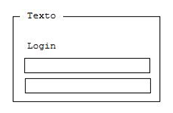
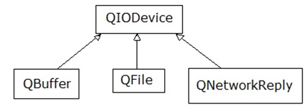

.. -*- coding: utf-8 -*-

.. _rcs_subversion:

Clase 06 - POO 2024
===================
(Fecha: 3 de abril)

Registro en video de algunos temas de la clase de hoy
^^^^^^^^^^^^^^^^^^^^^^^^^^^^^^^^^^^^^^^^^^^^^^^^^^^^^

`QGroupBox - QString number 2021 <https://www.youtube.com/watch?v=c7_axxXbphU>`_

`Sutileza con punteros - octal - arrays como parámetros 2021 <https://www.youtube.com/watch?v=XQOBvBVkffM>`_

`webservice network QIODevice QUrl 2021 <https://youtu.be/gX-DEWwXvh4>`_

`QNetworkAccessManager imagen de internet 2021 <https://youtu.be/JtENM7t2zxE>`_

`QNetworkAccessManager y colocar imagen en login 2023 <https://youtu.be/PFSWwS-RHyI>`_

QGroupBox
^^^^^^^^^ 

.. code-block::

	QGroupBox * grupo = new QGroupBox( "Texto" );
	QGridLayout * layout = new QGridLayout;
	
	layout->addWidget( label, 0, 0 );
	layout->addWidget( usuario, 1, 0, 1, 2 );
	layout->addWidget( clave, 2, 0, 1, 2 );
	
	grupo->setLayout( layout );

Sutilezas con punteros
^^^^^^^^^^^^^^^^^^^^^^

.. code-block::

	char cadena[ 10 ] = "hola";  
	// Funciona? sí. Qué hace con el sobrante?
	// Los completa a todos con \000

	char cadena[ 4 ] = "hola";   // Por qué no compila?

	char cadena[ 5 ] = "hola";   // Y por qué esto sí compila?

	// Porque la última posición se usa para el carácter nulo que el
	// compilador lo agrega (si tiene lugar).

	//    \000  (octal)
	//    \x0   (hexadecimal)    

Usando puntero para cadenas
^^^^^^^^^^^^^^^^^^^^^^^^^^^

.. code-block::

	char * cadena = "hola";      // el compilador agrega \000
	char * cadena = "ho\000la";  // Imprime  ho

- Asignamos memoria dinámicamente.
- No necesitamos especificar la longitud máxima.

Notación octal y hexadecimal
^^^^^^^^^^^^^^^^^^^^^^^^^^^^

.. code-block::

	cout << 3 + 4 + 11;      // Imprime 18
	cout << 3 + 4 + 011;     // ?

	//    octal    hexadecimal    decimal
	//    0121     0x51           81
	//    011      0x9            9
	//    '\000'   '\x0'          nulo
	//    '\063'   '\x33'         carácter 3

Punteros a punteros
^^^^^^^^^^^^^^^^^^^

.. code-block::

	char cadena[ 2 ][ 3 ];
	cadena[ 0 ][ 0 ] = 'f';
	cadena[ 0 ][ 1 ] = 'u';
	cadena[ 0 ][ 2 ] = 'e';
	cadena[ 1 ][ 0 ] = 'f';
	cadena[ 1 ][ 1 ] = 'u';
	cadena[ 1 ][ 2 ] = 'i';

	//    Mejor así

	char cadena[ 2 ][ 3 ];
	cadena[ 0 ][ 0 ] = 's';
	cadena[ 0 ][ 1 ] = 'i';
	cadena[ 0 ][ 2 ] = '\000';
	cadena[ 1 ][ 0 ] = 'n';
	cadena[ 1 ][ 1 ] = 'o';
	cadena[ 1 ][ 2 ] = '\000';
 
Array ≡ puntero
^^^^^^^^^^^^^^^

- Cuando declaramos un array
- Estamos declarando un puntero al primer elemento.

.. code-block::

	char arreglo[ 5 ];
	char * puntero;
	puntero = arreglo;  // Equivale a puntero = &arreglo[ 0 ];

Volviendo a puntero a puntero
^^^^^^^^^^^^^^^^^^^^^^^^^^^^^

.. code-block::

	char cadena[ 2 ][ 3 ] = { { 's', 'i', '\000' }, { 'n', 'o', '\000' } };
	// Y si fuera char cadena[ 2 ][ 3 ] = { { 's', 'i', '-' }, { 'n', 'o', '\000' } };
	char * p1;
	char * p2;

	p1 = cadena[ 0 ];   // p1 = &cadena[ 0 ][ 0 ];
	p2 = cadena[ 1 ];   // p2 = &cadena[ 1 ][ 0 ];

	cout << p1;  // si  
	cout << p2;  // no
	
	cout << *p1;  // ?
	cout << *p2;  // ?

	// Es decir:
	//    El identificador de un arreglo unidimensional 
	//    es considerado un puntero a su primer elemento.

**Ejemplo**

.. code-block::

	char p1[] = { 'a', 'b', 'c', 'd', 'e' };
	cout << "Letra " << *p1;   // Letra a
	cout << "Letra " << p1[ 0 ];   // Letra a

	char m2[][ 5 ] = { { 'a', 'b', 'c', 'd', 'e' }, { 'A', 'B', 'C', 'D', 'E' } };
	cout << "Letra " << **m2;          // Letra a
	cout << "Letra " << m2[ 0 ][ 0 ];      // Letra a
	cout << "Letra " << m2[ 1 ][ 3 ];      // Letra D
	cout << "Letra " << *( *( m2 + 1 ) + 3 );  // Letra D

**Extendiendo a arreglos de cualquier dimensión**

.. code-block::

	m[ a ] == *( m + a )
	m[ a ][ b ] == *( *( m + a ) + b )
	m[ a ][ b ][ c ] == *( *( *( m + a ) + b ) + c )

	//    Si nos referimos al primer elemento

	m[ 0 ] == *m
	m[ 0 ][ 0 ] == **m
	m[ 0 ][ 0 ][ 0 ] == ***m

Parámetros desde la línea de comandos
^^^^^^^^^^^^^^^^^^^^^^^^^^^^^^^^^^^^^

- Escribir el siguiente programa y ejecutarlo desde la línea de comandos para ver el uso de estos parámetros:

.. code-block::

	#include <iostream>

	int main( int argc, char ** argv )  {
	    std::cout << "Hay " << argc << " argumentos:" << std::endl;
	    for ( int i = 0 ; i < argc ; ++i ) {
	        std::cout << argv[ i ] << std::endl;
	    }
	}

Web Service
^^^^^^^^^^^

- Para intercambiar datos entre aplicaciones
- Generalmente a través del protocolo HTTP
- La info puede viajar en XML, JSON, etc.
- Fomenta y facilita el uso y desarrollo de APIs Web
- https://es.wikipedia.org/wiki/Servicio_web

**Algunas APIs disponibles**

- Twitter - https://dev.twitter.com
- Facebook - https://developers.facebook.com
- Amazon - https://developer.amazonservices.es
- Spotify - https://developer.spotify.com/web-api
- MercadoLibre - http://developers.mercadolibre.com
- Google - https://developers.google.com
	- Youtube
	- Traductor
	- Google+
	- Maps
	- Street View

QUrl
^^^^

- Para manipular una url ingresada por el usuario 

.. code-block::
	
	// URL ejemplo: http://www.yahoo.com.ar/documento/info.html
		
	// El método path() devuelve /documento/info.html
	// El método host() devuelve www.yahoo.com.ar
	
	QUrl url( "http://www.yahoo.com.ar/documento/info.html" );
	qDebug() << url.host();
	qDebug() << url.path();

QByteArray
^^^^^^^^^^

- Se podría decir que es administrador de un char*
- Se puede usar el operador []
- Almacena \\000 al final de cada objeto QByteArray

Clase QNetworkAccessManager
^^^^^^^^^^^^^^^^^^^^^^^^^^^

- Permite enviar y recibir solicitudes a la red
- Se obtiene un objeto ``QNetworkReply`` con toda la información recibida

.. code-block::

	QNetworkAccessManager * manager = new QNetworkAccessManager;

	connect( manager, SIGNAL( finished( QNetworkReply * ) ), this, SLOT( slot_respuesta( QNetworkReply * ) ) );

	manager->get( QNetworkRequest( QUrl( http://mi.ubp.edu.ar" ) ) );

- Para poder utilizar las clases de network hay que agregar en el .pro

.. code-block::

	QT += network  // Esto agrega al proyecto el módulo network

- Por defecto, el módulo 'gui' y el módulo 'core' están incluidos.
- Para utilizar HTTPS, Qt utiliza OpenSSL https://www.openssl.org/source
	- Se puede descargar desde https://slproweb.com/products/Win32OpenSSL.html
	- Por ejemplo, para 64 bits elegir `Win64 OpenSSL v1.1.1t <https://slproweb.com/download/Win64OpenSSL-1_1_1t.exe>`_

Clase QIODevice
^^^^^^^^^^^^^^^

- Clase base de los dispositivos de I/O
- Algunos métodos:

.. code-block::

	QByteArray readAll()  		   // Lee todos los datos disponibles.
	QByteArray read( qint64 max )  // Lee hasta max datos disponibles.
	QByteArray readLine()  		   // Lee una linea.

		
Clase QNetworkReply
^^^^^^^^^^^^^^^^^^^

- Contiene los datos y encabezado de una respuesta
- Una vez leídos los datos, ya no quedarán disponibles.
- Para controlar los bytes que se van descargando usar la señal:

.. code-block::

	void downloadProgress( qint64 bytesRecibidos, qint64 bytesTotal )

Clase QNetworkRequest
^^^^^^^^^^^^^^^^^^^^^

- Contiene la información que se envían en la petición
- Seteamos algún campo de la cabecera con:

.. code-block::

	void setRawHeader( const QByteArray &nombre, const QByteArray & valor )

	QNetworkRequest request;
	request.setUrl( QUrl( ui->le->text() ) );
	request.setRawHeader( "User-Agent", "MiNavegador 1.0" );

Clase QNetworkProxyFactory
^^^^^^^^^^^^^^^^^^^^^^^^^^

- Permite configurar un servidor proxy a nuestra aplicación Qt.
- Lo siguiente utiliza la configuración del sistema (Chrome y Edge, no Firefox, ¿Opera?, ¿Brave?).

.. code-block::

	#include <QApplication>
	#include "principal.h"
	#include <QNetworkProxyFactory>

	int main( int argc, char ** argv )  {
	    QApplication a( argc, argv );

	    QNetworkProxyFactory::setUseSystemConfiguration( true );

	    Principal w;
	    w.showMaximized();

	    return a.exec();
	}

Obtener una imagen desde internet
^^^^^^^^^^^^^^^^^^^^^^^^^^^^^^^^^

.. code-block::

	void Principal::slot_descargaFinalizada( QNetworkReply * reply )  {
	    QImage image = QImage::fromData( reply->readAll() );
	}

Ejercicio 14 (continuación):
============================

- Publicar en la ventana de Login, la temperatura actual en la Ciudad de Córdoba. Usar alguna API disponible.
- Agregar un método en Login que permita mostrar u ocultar la información de la temperatura.
- Además que la ventana de Login tenga como background una imagen descargada de interner, centrada y adaptada en tamaño, sin deformar su aspecto y que permita al usuario que modifique el tamaño del Login y que se siga viendo correctamente la imagen.
- Agregar un método en Login que permita indicar la URL de la imagen que se mostrará en el background. En caso que nunca se invoque a este método, ninguna imagen se mostrará.

Ejercicio 16 (continuación):
============================

- Que el endpoint para validar a los usuarios sea con un POST y que devuelva "denegado" o que devuelva el nombre y el apellido del usuario en el siguiente formato: "Juan Carlos::Ponce"
- Probar el funcionamiento de este endpoint mediante la web de prueba de FastAPI.
