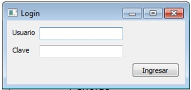
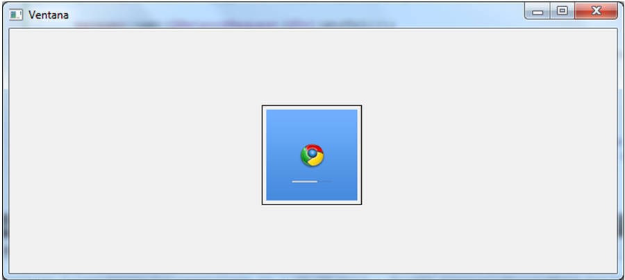

.. -*- coding: utf-8 -*-

.. _rcs_subversion:

Clase 09 - POO 2024
===================
(Fecha: 15 de abril)

Simulacro de examen parcial
===========================

Ejercicio A
^^^^^^^^^^^
	
- Comenzar un proyecto vacío con QtCreator y diseñar un login de usuarios como el siguiente:
 

- Tendrá un tamaño de 250x120 píxeles y llevará por título "Login".
- Para el layout utilizar QGridLayout.
- El único usuario válido es el DNI de estudiante y como clave sus últimos 3 números del DNI.
- Ocultar con asteriscos la clave y detectar el Enter para validar al usuario.
- Si el usuario y clave no es válido, sólo el campo de la clave se deberá limpiar.
- Al fallar la clave 3 veces, la aplicación se cierra. 
- Si el usuario es válido, entonces se oculta el login y se visualiza un nuevo QWidget como el que sigue:

- Utilizar una imagen del disco aproximadamente de 100x100 píxeles.
- Esta imagen se mostrará en el QWidget exactamente centrada.
- Dibujar además un cuadrado que envuelva la imagen (como muestra el ejemplo).

Ejercicio B
^^^^^^^^^^^

- Crear una aplicación que inicie con un login validando el usuario admin:123
- Luego de ingresar el usuario válido, mostrar un nuevo QWidget con las siguientes características:
	- Definida en la clase Editor
	- Contendrá un QTextEdit vacío, un QLineEdit, un QPushButton "Buscar" y un QLabel
	- El usuario podrá escribir cualquier texto en el QTextEdit.
	- EL usuario podrá escribir también en el QLineEdit un caracter, una cadena o una frase.
	- Al presionar "Buscar" se detectará automáticamente la cantidad de ocurrencias encontradas de los que se escribió en el QLineEdit.
	- El resultado de colocará en el QLabel, indicando, por ejemplo, "14 ocurrencias."
- Luego de dejar funcionando lo anterior, agregar lo siguiente:
	- Un QLineEdit y un QPushButton "Guardar"
	- En este QLineEdit el usuario puede colocar el nombre de un archivo .txt
	- Al presionar Guardar se almacenará todo el texto del QTextEdit en este archivo .txt

Ejercicio C
^^^^^^^^^^^

- Crear una clase Barra para dar funcionalidad a una barra de progreso
- Que la barra tenga el siguiente aspecto:

- Debe tener métodos para setear su valor en porcentaje
- Usar la señal de ``downloadProgress`` de ``QNetworkReply`` para controlar el porcentaje de descarga
- Crear una interfaz que tenga un ``QLineEdit`` para una URL y un objeto Barra.
- Probarlo con alguna URL que pertenezca a un archivo de tamaño superior a 50MB para que se note la demora en la descarga.

Ejercicio D
^^^^^^^^^^^

- Diseñar una aplicación para una galería de fotos
- En un archivo .txt almacenar en cada línea, una URL a una imagen
- Un botón >> y otro botón << para avanzar o retroceder en la galería de fotos

Ejercicio E
^^^^^^^^^^^

- Definir la clase Ventana que herede de QWidget
- Usar desde el disco una imagen de una bola 8 con formato PNG (para usar transparencias).
- Ventana tendrá un QGroupBox con los siguientes parámetros:
	- Diámetro de la bola (en píxeles)
	- Velocidad (segundos para ir de lado a lado)
	- QPushButton para actualizar estos parámetros en la bola
- La bola irá golpeando de izquierda a derecha en la Ventana.