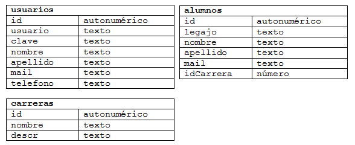

.. -*- coding: utf-8 -*-

.. _rcs_subversion:

Clase 12 - POO 2024
===================
(Fecha: 6 de mayo)

Registro en video de algunos temas de la clase de hoy
^^^^^^^^^^^^^^^^^^^^^^^^^^^^^^^^^^^^^^^^^^^^^^^^^^^^^

`SQLite, AdminDB y función virtual pura 2023 <https://youtu.be/sJu1Icc4rkQ>`_

`AdminDB 2022 <https://youtu.be/vvGJMZbvM6Q>`_ 

`Base de datos 2021 <https://youtu.be/tgPejo-NV-Y>`_

Vista obligatoria
^^^^^^^^^^^^^^^^^

`Función virtual pura clase abstracta 2021 <https://youtu.be/LjxmhcdzZbs>`_

Función virtual pura y clase abstracta
======================================

- No necesita ser definida, sólo se declara.
- Será definida en las clases derivadas

.. code-block:: c

	virtual void verValor( int a ) = 0;

- Una clase con al menos una función virtual pura la convierte en clase abstracta.
- Una clase abstracta no puede ser instanciada.
- Si en la clase derivada no se define la función virtual pura, significa que esta clase derivada también es abstracta.

Conexión a base de datos
^^^^^^^^^^^^^^^^^^^^^^^^

**Ejemplo de la estructura de las tablas en la base de datos**

- Con Qt se pueden utilizar los siguientes motores de base de datos:
	- **ODBC (Open DataBase Connectivity)**: 
		- Estándar de acceso a base de datos
		- Usado con Microsoft Access en Windows
		- Está disponible en Windows: Panel de control -> Herramientas administrativas -> ODBC Data sources
			
	- **SQLite**
		- Es un sistema de gestión de bases de datos relacional.
		- En C y libre
		- Los datos se almacenan en un archivo
		- No es cliente-servidor. La librería (dll) tiene funciones para trabajar
		- No requiere instalación, directamente con un ejecutable
		- Para Linux, Windows, Mac OS, Android, iOS, BlackBerry OS, Windows Phone, ...
			
	- **MySQL**
		- Quizás el motor de base de datos más utilizado
		- Requiere una instalación más avanzada para usar con Qt dependiendo el SO que se utilice.
		
Usando SQLite
^^^^^^^^^^^^^

**Creación de una base de datos SQLite**
	
- Descargar de http://www.sqlite.org/download.html
- Precompiled Binaries for Windows–Linux–MAC (The command-line shell program)
- En Linux se puede hacer: ``sudo apt-get install sqlite3``
- Al descomprimir tenemos el ejecutable sqlite3
- Creamos una carpeta C:/Qt/db (o /home/db) y copiamos ahí el ejecutable
- En consola creamos una base de datos, por ejemplo, llamada ``test`` con una tabla ``usuarios``

::

	sqlite3 test

	create table usuarios (
	    id integer primary key,  (es autoincrementable)
	    usuario varchar(30),
	    clave varchar(30),
	    nombre varchar(50),
	    apellido varchar(50),
	    mail varchar(50)
	);

	// Podemos insertar un registro 

	insert into usuarios (usuario, clave,	nombre, apellido, mail) 
	values ("cgomez", "1234", "Carlos", "Gomez", "cgomez@gmail.com");

	// Podemos ver el contenido de la tabla "usuario":

	select * from usuarios;

	// Para salir de la base:
		
	.exit

En Qt	
^^^^^

- Requiere QT += sql
- Para averiguar los controladores disponibles, usamos el método estático:

.. code-block:: c

	qDebug() << QSqlDatabase::drivers();  // Devuelve un QStringList

- Un objeto QSqlDatabase representa la conexión a la base
- Elegimos el controlador y conectamos:

.. code-block:: c

	QSqlDatabase db = QSqlDatabase::addDatabase( "QSQLITE" );

	db.setDatabaseName( "C:/Qt/db/test" ); 
	if ( db.open() )
	    qDebug() << "Conexión exitosa";
	else
	    qDebug() << "No se pudo abrir la base";

- En Windows, para usar el archivo Access ``C:/db/base.mdb`` se hace lo siguiente:
	
.. code-block:: c
		
	QSqlDatabase db = QSqlDatabase::addDatabase( "QODBC" );

	db.setDatabaseName( "DRIVER={Microsoft Access Driver (*.mdb, *.accdb)};"
	                    "DBQ=C:/db/base.mdb" ); 
	if ( db.open() )
		qDebug() << "Conexión exitosa";

**Preparando la clase AdminDB**

- Definir una clase AdminDB para administrar la base de datos
- Crear el siguiente método:

.. code-block:: c
	
	bool conectar(QString archivoSqlite); 

- En un proyecto nuevo y desde la función main() intentar la conexión.

.. code-block:: c

	// --- adminDB.h ---------------
	#include <QSqlDatabase>
	#include <QString>
	#include <QObject>

	class AdminDB : public QObject  {
	    Q_OBJECT

	public:
	    AdminDB();
	    bool conectar( QString archivoSqlite );
	    QSqlDatabase getDB();

	private:
	    QSqlDatabase db;
	};

	// --- adminDB.cpp ------------
	#include "adminDB.h"

	AdminDB::AdminDB()  {
	    db = QSqlDatabase::addDatabase( "QSQLITE" );
	}

	bool AdminDB::conectar( QString archivoSqlite )  {
	    db.setDatabaseName( archivoSqlite );

	    if( db.open() )
	        return true;

	    return false;
	}

	QSqlDatabase AdminDB::getDB()  {
	    return db;
	}

	// --- main.cpp  ----------------
	#include <QApplication>
	#include "adminDB.h"

	int main( int argc, char** argv )  {
	    QApplication a( argc, argv );

	    qDebug() << QDir::currentPath();

	    AdminDB adminDB;
	    if (adminDB.conectar( "C:/Qt/db/test" ) )
	        qDebug() << "Conexion exitosa";
	    else
	        qDebug() << "Conexion NO exitosa";

	return 0;
	}

Consulta a la base de datos
^^^^^^^^^^^^^^^^^^^^^^^^^^^

.. code-block:: c

	QSqlDatabase db = QSqlDatabase::addDatabase( "QSQLITE" );

	db.setDatabaseName( "C:/Qt/db/test" ); 

	if ( db.open() )  {
	    QSqlQuery query = db.exec( "SELECT nombre, apellido FROM usuarios" );

	    while( query.next() )  {
	        qDebug() << query.value( 0 ).toString() << " " << query.value( 1 ).toString();
	    }
	}

	

**Ejemplo**: slot de la clase Login para que valide usuarios contra la base

.. code-block:: c

	void Login::slot_validar()  {
	    bool usuarioValido = false;

	    if ( adminDB->getDB().isOpen() )  {  
	        QSqlQuery * query = new QSqlQuery( adminDB->getDB() );

	        query->exec( "SELECT nombre, apellido FROM usuarios WHERE usuario='" + 
	        leUsuario->text() + "' AND clave='" + leClave->text() + "'" );

	        // Si los datos son consistentes, devolverá un único registro.
	        while ( query->next() )  {

	            QSqlRecord record = query->record();

	            // Obtenemos el número de la columna de los datos que necesitamos.
	            int columnaNombre = record.indexOf( "nombre" );
	            int columnaApellido = record.indexOf( "apellido" );

	            // Obtenemos los valores de las columnas.
	            qDebug() << "Nombre=" << query->value( columnaNombre ).toString();
	            qDebug() << "Apellido=" << query->value( columnaApellido ).toString();

	            usuarioValido = true;
	        }

	        if ( usuarioValido )  {
	            QMessageBox::information( this, "Conexión exitosa", "Válido" );
	        }
	        else  {
	            QMessageBox::critical( this, "Sin permisos", "Usuario inválido" );
	        }
	    }
	}

Registrar eventos (logs)
^^^^^^^^^^^^^^^^^^^^^^^^

.. code-block:: c

	bool AdminDB::registrar( QString evento )  {
	    QSqlQuery query( db );

	    bool exito = query.exec( "INSERT INTO registos (evento) VALUES ('" + evento + "')" );

	    qDebug() << query.lastQuery();
	    qDebug() << query.lastError();  // Devuelve un objeto de QSqlError

	    return exito;
	}

Ejercicio 14 (continuación):
============================

- Este ejercicio viene de la clase 5, 7 y 8.
- Incorporar la validación de usuarios con QSLite.
- Todo lo que se haga con la base de datos, que se encuentre en la clase AdminDB
- Pueden utilizar SQLiteStudio (`https://sqlitestudio.pl <https://sqlitestudio.pl>`_) o similar.
